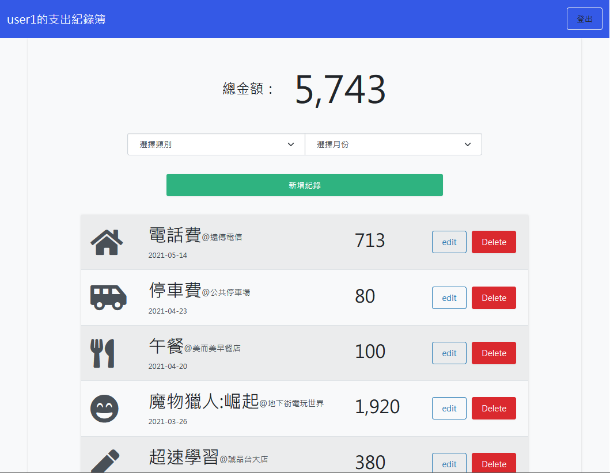

# Expense Tracker

由 mongodb 與 nodeJS 開發的個人記帳應用程式。



## 功能
* 瀏覽所有的支出紀錄
* 新增一筆支出紀錄
* 修改一筆支出紀錄的所有屬性
* 刪除一筆支出紀錄
* 可依照支付類別篩選支出紀錄
* 篩選後顯示該類別的支付總額

## 環境建置與需求 (prerequisites)
 * [Node.js](https://nodejs.org/en/): v15.11.0
 * [MongoDB](https://www.mongodb.com/try/download/community): v4.2.13

## 專案啟動方式
  1. 下載專案壓縮檔或使用git clone至個人電腦
  ```bash
    git clone https://github.com/stylelinz/expense-tracker.git
  ```
  2. 進入專案資料夾，在終端機輸入以下指令
  ```bash
    cd expense-tracker
  ```
  3. 安裝npm套件，在終端機輸入以下指令
  ```bash
    npm install
    npm i nodemon
  ```

  4. 在終端機輸入以下指令新增種子資料
  ```bash
    npm run seed
  ```

  5. 啟動伺服器，執行 app.js 檔案，輸入以下指令
  ```bash
    npm run dev
  ```

  6. 當終端機出現以下字樣，表示伺服器與資料庫已啟動並成功連結，可以在瀏覽器觀看 http://localhost:3000
  ```bash
    Express is listening on http://localhost:3000
    mongodb connected!
  ```

  7. 在終端機按下 `ctrl` + `c` 或 `cmd` + `c`，以關閉伺服器